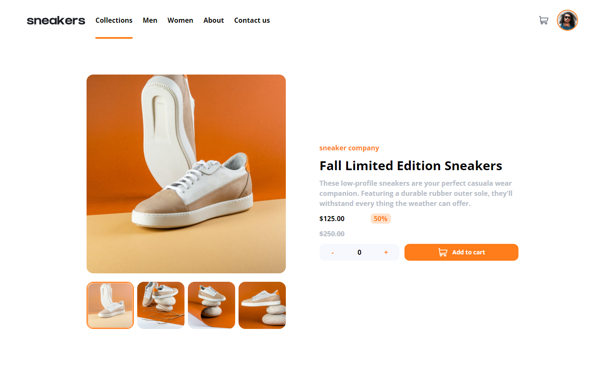

# Frontend Mentor - E-commerce product page solution

This is a solution to the [E-commerce product page challenge on Frontend Mentor](https://www.frontendmentor.io/challenges/ecommerce-product-page-UPsZ9MJp6). Frontend Mentor challenges help you improve your coding skills by building realistic projects.

## Table of contents

- [Overview](#overview)
  - [The challenge](#the-challenge)
  - [Screenshot](#screenshot)
  - [Links](#links)
- [My process](#my-process)
  - [Built with](#built-with)
  - [What I learned](#what-i-learned)
  - [Continued development](#continued-development)
- [Author](#author)
- [Acknowledgments](#acknowledgments)

## Overview

### The challenge

Users should be able to:

- View the optimal layout for the site depending on their device's screen size
- See hover states for all interactive elements on the page
- Open a lightbox gallery by clicking on the large product image
- Switch the large product image by clicking on the small thumbnail images
- Add items to the cart
- View the cart and remove items from it

### Screenshot

### Links

- Live Site URL: [https://awesome-haibt-3c7809.netlify.app/]

## My process

### Built with

- HTML5
- CSS custom properties
- Flexbox
- CSS Grid
- Mobile-first workflow
- [VueJs 3](https://v3.vuejs.org/) - JS library
- [Tailwind css](https://tailwindcss.com/) - For styles

### What I learned

- Tailwind css : Was the first time i use tailwind css and i really loved it
- Vue 3 & Vuex : Was the first time creating modals and images carousel using Vue .. I usually prefer working with React but after this project i may change my mind again 😁

### Continued development

- should work more on creating cool animations there are some libraries in react the healps with animations but i dont know about Vue yet.

## Author

- Frontend Mentor - [@ramy100](https://www.frontendmentor.io/profile/ramy100)

## Acknowledgments

Thanks to The Net Ninja for the awesome Vue 3 course 😁
